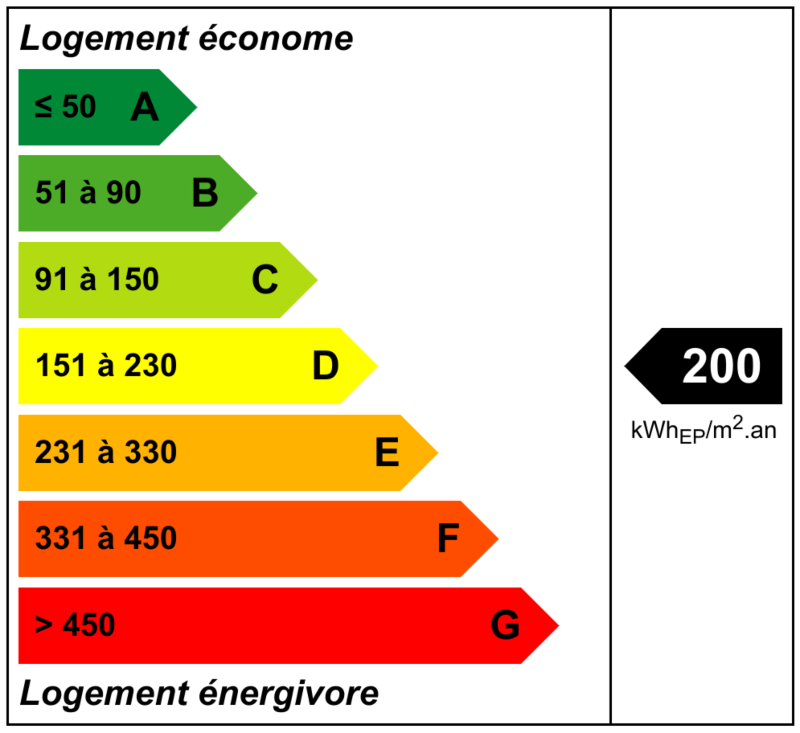

# jquery-efDPE
Plugin jQuery pour l'affichage de [diagrammes de performance énergétique](https://fr.wikipedia.org/wiki/Diagnostic_de_performance_%C3%A9nerg%C3%A9tique) (immobilier)



## Installation
Inclure le fichier JavaScript contenant le plugin ainsi que la feuille de style CSS en plaçant ces lignes dans le `<head></head>` de votre fichier HTML :
```HTML
<script src="jquery.efDPE.js"></script>
<link href="jquery.efDPE.css" rel="stylesheet" />
```
Ce plugin nécessite également jQuery que vous trouverez sur http://jquery.com/download/.

## Utilisation
NB : un exemple est disponible dans le répertoire du dépôt.
Il faut simplement appeler le plugin dès que le DOM est chargé, par exemple :
```JavaScript
$(function() {
    $('element').efDPE();
});
```
L'élément devra posséder un attribut `data-valeur` contenant la performance énergétique du bien.
Par exemple :
```HTML
<div id="tdpe" data-valeur="200"></div>
```
À noter que vous pouvez transmettre cette valeur directement lors de l'appel au plugin :
```JavaScript
$(function() {
    $('element').efDPE({ valeur: 200 });
});
```
D'autres options sont disponibles comme la personnalisation des couleurs ou l'affichage de la légende (cf. `jquery.efDPE.js`).
